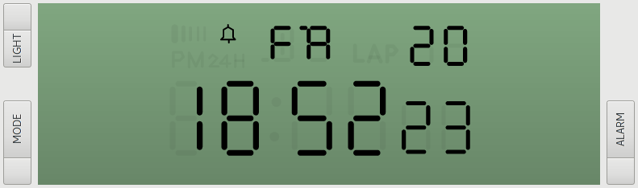

Pluto is a programmable digital watch that re-uses case and LCD 
panel of the Casio® F-91W.  This is the software repo, for the 
hardware side of things and a more information, see the
[hardware repo](https://github.com/carrotIndustries/pluto).
This document is incomplete as it only covers the most important aspects of the firmware, the rest is 
left as an exercise to the reader.

# Features
- Displays time in decimal/binary/hexadecimal base
- Multiple alarms
- Multiple countdown timers
- Uses RTTTL ringtones for alarm sound
- Stopwatch
- Compass
- Speedometer (Enter distance, watch measures time and displays speed in km/h)
- Generation of time-based one-time passwords according to RFC 6238 (WIP)
- Menu-driven interface
- Infrared receiver for software updates and TOTP secret transfer (WIP)
- Useless customisation (Key beep frequency, etc.)
- greater than 1 year battery life (estimate based on current consumption)

## Assisted calibration
Aside from being a cool nerd gadget pluto's main purpose is accurately
telling the time. To do so, the RTC needs to be calibrated to
compensate for the crystal's error. To simplify this, the
firmware can now assist the user by keeping track of how long it's been
since the time has last been set. The process goes like this (`acal` in
the time menu):

- **ME**asure: press enter when the minute changs on the reference clock, the time difference will be shown
- **S**econds since **L**ast set: shows how long it's been since the time has been set in units of 100 seconds
- P**PM**: shows the calculated deviation in units of 10ppb, may display "over" when the valued exceeds the displayable range
- **CAL**ibration **st**ore: takes the calculated ppm value, subtracts it from the current calibration value and updates the calibration
- **ADJ**ust: corrects the time by the measured value. Correction only takes place when the correction value can be applied without overflow, PM flashed while correction is pending.


# Architectural overview
To simplify development, the pluto firmware can be compiled to run on 
Linux. User interface (LCD screen and buttons) is provided by a Gtk+ 
application the firmware connects to using a pair of ZeroMQ sockets. In 
spite of being technically inaccurate, this mode of operation is called 
'simulator'.
This requires dividing the firmware in three layers:

## Hardware Abstraction Layer (hal)
This layer provides the interface to the underlying hardware. Currently, there are HALs for 
the MSP430FR6972 target and the simulator running on Linux. Only the hardware-dependent aspects 
are implemented here, the hardware-independent aspects are left to the 
next layer to avoid code duplication.

## Services (svc)
The services layer implements hardware-independent features like 
playing back RTTTL ringtones, providing the LCD character set and
handling menu operation.

## Application (app)
The application layer provides the user interface. Currently, the 
application layer is dependent on the F-91W's LCD layout.

# Simulator
As explained earlier, the firmware can be compiled to run on Linux. 
This way, the firmware has been developed before the hardware being 
available. Not having to fiddle with the tiny watch hardware makes 
development of target-independent features much easier as well. To 
simplify debugging of the firmware, the user interface consisting of the LCD screen and 
buttons runs as a separate process the firmware connects to using a 
pair of ZeroMQ sockets. The buzzer is emulated inside of the firmware 
itself using a direct digital synthesis approach. To make the emulated 
buzzer sound more real, the DDS lookup is rich of odd and even 
harmonics. Sound is output using pulseaudio. Primarily due to laziness, 
the emulator doesn't support these features :

- setting time/date
- RTC calibration
- persistent settings
- non-constant compass values
- backlight dimming

This list is very likely to be incomplete, nevertheless the simulator 
has proven to be quite useful. Obligatory screenshot:


# Target
To conserve power and get anywhere near an acceptable battery life, the 
firmware has to make aggressive use of the MSP430 low power features. 
Most of the time, the MCU is asleep in LPM3 mode. In this mode, only 
the low-frequency clock ACLK (sourced from 32.768 kHz crystal) and 
low-power peripherals, like LCD and RTC are active. The MCU gets woken 
up by interrupts:

- RTC as 4Hz tick source, used for display updating and time 
  base for countdown timers.
- ~100Hz debounce timer: This timer only runs, when the aforementioned 
  button polling ISR detects a pressed button.
- 128Hz AUX timer: This timer gets enabled by the services when there's 
  need for high-precision timing of events like RTTTL playback or the 
  stopwatch.
- 16Hz timer interrupt for button polling: Because of layout 
  constraints, the buttons aren't connected to interrupt-capable GPIO 
  pins, so this interrupt is used. Since the associated interrupt 
  service routine only checks for the state of three GPIO pins, and 
  quickly goes back to sleep, its power footprint is negligible. 

All ISRs except for the last one exit the low-power mode, so the main 
loop will get called.

# Detailed architecture
## HAL
The HAL provides a unified interface to the target's and simulator's 
features:
### LCD
The HAL groups the LCD into digits. A digit is either a 
7-segment-like digit or a bunch of indicators.
The simulator's HAL sends the segments to be set over to the display 
process as a ZeroMQ message. The target has has to use a mapping table 
that maps HAL LCD segments to the appropriate COM and SEG lines.
### Other features
The remaining features are pretty mundane, in case you want to 
implement a new hal, take a look at common/hal/hal.h to find out what 
you need to implement.

## Events
To meet above power requirements, the pluto firmware is event-based. 
Once the main loop gets called, it figures out why it's been called and 
populates a bitfield typed `svc_main_proc_event_t` accordingly and 
hands over to `svc_main_proc`. After handling services-related things 
like processing alarms and countdown timers, it'll dispatch the event 
to the currently active app.

## Apps, Views and Menus
An app provides a distinct set of features to the users. It doesn't contain any 
business logic, that's what the services are for. An app is divided 
into multiple views. A view is roughly equivalent to one level in menu 
hierarchy. A view's main function may either just call the menu in case 
the view offers a constant number of choices to the user or may handle 
events and drawing all by itself when more complex interaction is 
required. Aside from a list of items, the menu provides a facility for 
handling numeric input. To accommodate different use cases, the menu 
relies on the application to translate incrementing and decrementing a 
single digit into an actual numeric value taking into account clipping 
and other constraints.

## LCD
The services layer uses a character table for each kind of LCD digit to 
provide the best possible character rendering for each segment. It 
provides functions for writing strings and integers to the LCD.

## OTP generation
Right now, the OTP generator is WIP, since there isn't a way to 
synchronize the OTP clock and uploading secrets involves taking apart 
the watch and flashing the firmware. To protect the OTP secrets, 
they're encrypted using the MSP430's built-in AES peripheral. The 
key is derived from the 4-digit PIN using the first 128bits of the 
PIN's SHA-1 hash. One has to take care to pad the secrets with random 
bytes, so that an attacker can't tell whether a PIN is correct or not. 
You're welcome to improve the security of the secret storage.

## Persistent settings
Since the MSP430FR6972 uses FRAM for nonvolatile storage, writing 
nonvolatile data is as easy as writing to RAM. All nonvolatile 
variables are linked into a dedicated section, that can be left 
unmodified when updating the firmware. That's what the "program-noload"
target is for. Currently, alarms, countdown timers, OTP secrets and 
some settings are stored in nonvolatile memory.

# How do I build?
## Dependencies for both target and simulator
 - python 3 (3.5 tested)
 - python-rtttl for parsing RTTTL ringtones
 - make

## Dependencies for simulator
 - C compiler (gcc tested)
 - zeromq (for communication between firmware and GUI)
 - pulseaudio (for buzzer simulation)
 - mbedtls (for simulating the MSP430's hardware AES)
 - python (GUI)
 - Gtk+ 3 (GUI)
 - pygobject (GUI)

## Dependencies for target
 - msp430-elf toolchain
 - mspdebug for firmware programming

With these dependencies satisfied, the pluto firmware should build on 
any reasonably up-to-date Linux distribution. 

## Building and running simulator
```
$ cd sim
$ make
$ ./emu.py&
$ ./sim
```

## Building for target
```
$ cd target
$ make
$ make program
```
You may have to modify the Makefile to suit your particular programmer.

# Credits
Thanks go to [sh-ow](https://github.com/sh-ow) for implementing parts 
of the MSP430 HAL.

# Included third-party software
- [mbedtls](https://tls.mbed.org/) SHA-1 for use in HMAC
- [MSP430 driverlib](http://www.ti.com/tool/mspdriverlib) AES256 
  peripheral driver
- [liboath](http://www.nongnu.org/oath-toolkit/liboath-api/liboath-oath.html)
  for TOTP generation
- [Example of bit-banging the I²C Master protocol](https://en.wikipedia.org/wiki/I%C2%B2C#Example_of_bit-banging_the_I.C2.B2C_Master_protocol) No idea why this ended up in Wikipedia. However, it's one of the 
 better soft I²C master implementations out there.
- [XY vector to integer degree fast algorithm](http://www.romanblack.com/integer_degree.htm) for heading calculation
